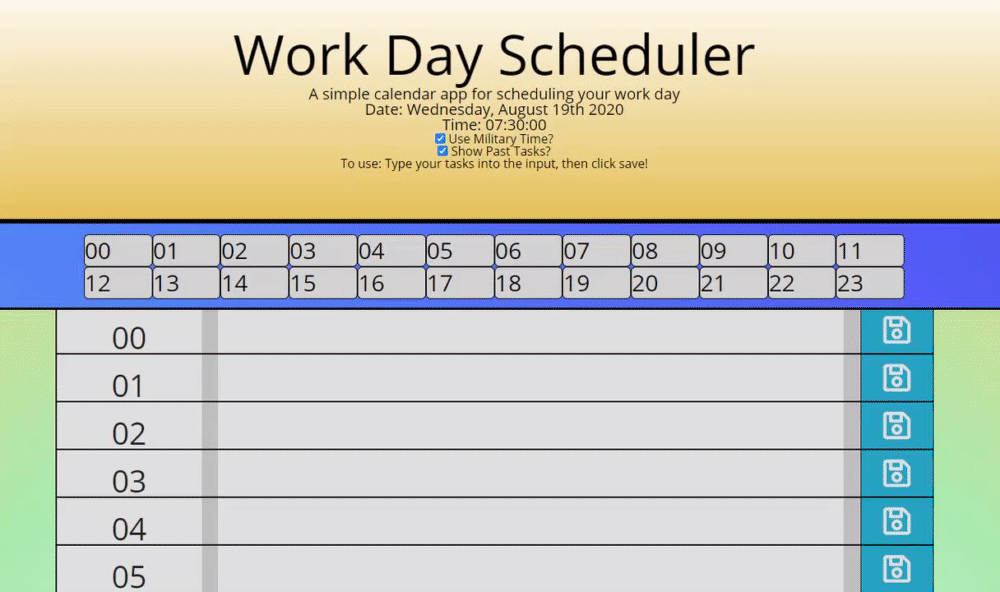

---

# Daily Planner!

### [Click Here To Start Planning](https://sakiskid.github.io/daily-planner/)

#### **8/20/2020** 

## Description:
Here is a little daily planner I've created. It's good for remembering things throughout your day, however once I learn SQL and database structure I would love to revisit this and make an application that is a little more useful.

## Features
- Saves to Local Storage for all day planning
- Quick-links to hours of the day that stays fixed to the top of the screen
- Military or Standard time formats
- Hide your past tasks!

##### Noteworthy:
- Created with future use and modularity in mind. The HTML is NOT bloated. The scrollspy (navbar at the top) and the timeblock table are both populated at runtime, which means that it should be easy for other developers to pick this project up and modify timeblocks pretty easily.

## Execution:
- *getLocalStorage function*: This is a multi-use function that I plan on re-using in future projects. It takes in a `key` string and a `value` string. If the key exists, return the localStorage value. If it *doesn't* exist, create a new localStorage index with that name, assign it that value, then return the value from localStorage.
- The easiest part of this for me was populating the timeblock with templates... the hardest part is STILL css and layout. I feel like my websites are all ugly, so I think I'm going to be taking a UI design course soon after these projects.
- The scrollspy was troublesome. I had to figure out how to remove and add the nav-links when using 'hide past tasks'. The scrollspy also gave me issues when detecting which parts of the page I was currently on. I solved this using `scroll-margin-top` and adding blank whitespace on the bottom of the page.
- If I were to do this over again, I would use global variables in a separate javascript file for things like 'how many timeblocks to generate', as well as string vars for all of the localStorage keys and DOM references.

### Things I learned
- How to center FA objects. I had to set both the FontAwesome wrapper and it's parent to `flex`. Only then was I able to vertically align the objects.
- I used three event listeners in this code, one of which listened for changes to the `document`. I needed to target the document specifically (and then the .saveBtn) because my saveBtns were dynamically added after the page had loaded. A normal eventlistener wouldn't have worked here.